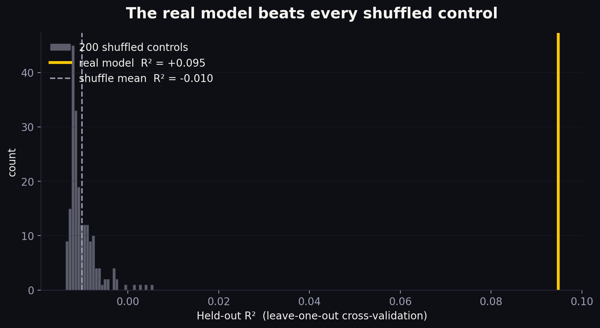

# Pokémon × TRIBE v2

> Does the human brain know which Pokémon cards are valuable?

A personal thought experiment. I scraped my 213-card Pokémon portfolio from [Collectr](https://getcollectr.com), ran each image through [**TRIBE v2**](https://github.com/facebookresearch/tribev2) — Meta's foundation model that predicts human fMRI brain responses to images — and asked whether the predicted brain activation correlates with market price.

**It does.** The left visual cortex correlates with `log(price)` at **r = +0.44**, and the full 14-region model beats 100% of 200 shuffled controls at a held-out R² of **+0.095**.

---

## Result at a glance

| | |
|---|---|
| Cards analyzed | 213 (200 Pokémon + 13 YuGiOh) |
| Total portfolio value | $5,641 |
| Strongest ROI → price correlation | `occipital_L` (left visual cortex), **r = +0.44** |
| Held-out R² (Ridge + LOO-CV) | **+0.095** |
| Shuffle-control null R² (mean) | −0.010 |
| Percentile of real R² in null distribution | **100th** |
| "Hidden gems" (brain ranks ≥ 30 higher than market) | **61 cards** |
| "Skeptics" (market ranks ≥ 30 higher than brain) | **68 cards** |



## The brain's bets

Ranking each card by brain response and by market price, the top disagreements are the shareable story:

**Hidden gems** — visually striking full-art cards trading for a dollar:

| Card | Market | Brain rank → implied |
|---|---|---|
| Harpie's Pet Baby Dragon (Enemy of Justice) | $1.14 | +105 ranks → ~$75.80 |
| Clawitzer JP (Rising Fist) | $1.00 | +104 ranks → ~$51.25 |
| Beedrill (XY Base Set) | $1.48 | +99 ranks → ~$82.78 |

**Market knows best** — expensive despite looking plain:

| Card | Market | Brain rank → implied |
|---|---|---|
| Snorlax (EX FireRed & LeafGreen) | $119.56 | −134 ranks → ~$0.66 |
| Fire Energy (EX Power Keepers) | $7.72 | −129 ranks → ~$0.12 |
| Mew (EX Holon Phantoms) | $171.09 | −123 ranks → ~$1.00 |

"Implied" = the actual market price at the brain's rank position — not a forecast, a disagreement signal. The visual cortex is good at spotting cards designed to *look* expensive, and blind to cards that are expensive *despite* looking plain.

## Pipeline

```
Collectr (Playwright scrape)
       ↓
  213 card images
       ↓
each image → 2-sec silent MP4 → TRIBE v2 → (n_TRs × 20,484) fMRI prediction
       ↓
  aggregate to 14 anatomical ROIs
       ↓
Ridge → log(price), leave-one-out CV
       ↓
shuffle 200×, compute null distribution
       ↓
static HTML site + MP4 promo
```

Five local Python scripts, a Jinja2 template for the site, a Remotion project for the video. Nothing runs in the cloud. Everything runs on a single M4 Max.

## Repository layout

```
scripts/
  scrape_collectr.py       # Playwright auth + /api/collections/{user}/products capture + image download
  run_brain_inference.py   # image → silent MP4 → TRIBE v2 → ROI vector
  analyze.py               # Pearson + Ridge LOO-CV + shuffle control
  render_heatmaps.py       # nilearn fsaverage5 PNGs per card
  build_site.py            # Jinja2 render with rank-based "brain's bets"
  make_post_visuals.py     # Matplotlib PNGs for Medium/LinkedIn
templates/
  index.html.j2            # Single-page, no JS, inline CSS + SVG
posts/
  medium.md                # Long-form article with embedded images
  linkedin.md              # Tight 200-word LinkedIn version
  assets/                  # Five share-ready PNGs
promo/
  src/                     # Remotion React/TypeScript scenes
  out/                     # Rendered promo-vertical-1080x1920.mp4 + promo-square-1080x1080.mp4
  scripts/prep_assets.py   # Curates 7 cards + stats.json for the video
Makefile                   # install | scrape | brains | analyze | heatmaps | site | deploy | all
```

## Setup (from a fresh clone)

```sh
# 1. Clone this repo
git clone https://github.com/eliseorobles/PokemonTribeV2.git
cd PokemonTribeV2

# 2. Clone Meta's TRIBE v2 alongside (gitignored here — CC BY-NC, not redistributed)
git clone https://github.com/facebookresearch/tribev2.git

# 3. Python environment
python3.11 -m venv venv
source venv/bin/activate
pip install -e "tribev2[plotting]"
make install   # installs playwright + chromium

# 4. Remotion promo video environment (optional)
cd promo && npm install && cd ..
```

## Run the pipeline

```sh
source venv/bin/activate

# 1. Scrape your own Collectr portfolio
#    First run is headed: log in to Collectr when the window opens.
make scrape

# 2. Brain inference  (~1.5 min/card · 2 parallel workers = ~5 hrs for ~200 cards)
python -u scripts/run_brain_inference.py --shard 0/2 &
python -u scripts/run_brain_inference.py --shard 1/2 &
wait

# 3. Stats → JSON
make analyze

# 4. Brain heatmaps + static site
make heatmaps
make site

# 5. (optional) Render promo video
cd promo
python3 scripts/prep_assets.py
npm run render:all
```

## Deploy

The site deploys as a static bundle to Cloudflare Pages (free):

```sh
npx wrangler pages deploy site --project-name pokemon-brain
```

Custom domain: in the Cloudflare dashboard, Pages → `pokemon-brain` → Custom Domains → add `pokemon.yourdomain.com`. Cloudflare handles the CNAME automatically.

## Caveats

- **This isn't financial advice.** Pokémon prices are set by scarcity, nostalgia, meta, grading population, and hype — not by predicted brain activation. The correlation says only that the visual features that make a card *look* valuable overlap with the features that *are* valuable.
- **Correlation ≠ causation.** The visual cortex is rediscovering "bold, famous, recognizable" — a design signal Pokémon intentionally encodes into valuable cards.
- **Small N.** 213 cards × 14 ROIs would overfit a ridge regression without leave-one-out + a shuffle control. Both are baked into the pipeline.
- **Out-of-distribution inputs.** TRIBE v2 was trained on naturalistic video, audio, and images. A static Pokémon card wrapped as a silent 2-second video is off-distribution; the audio and language extractors see nothing. The signal comes purely from V-JEPA2's visual stream.

## Licensing and fair-use notice

- **Code**: MIT (see [LICENSE](LICENSE)).
- **[TRIBE v2](https://github.com/facebookresearch/tribev2)** (cloned separately): CC BY-NC. Personal experiments only — no commercial use.
- **Card images** displayed in `site/assets/cards/` and `promo/` at build time are © The Pokémon Company / Nintendo / Creatures Inc. and are sourced from Collectr's catalog CDN. They're reproduced here at thumbnail scale for commentary and personal research, consistent with fair use. They are not redistributed in this repository — they are gitignored and must be downloaded by running the scraper against your own Collectr account.
- **Collectr scraping**: The scraper targets a personal portfolio owned by the operator. Collectr's terms of service prohibit scraping generally; running this against someone else's data is your problem to check.

## Write-ups

- [Medium essay](posts/medium.md) — long-form with embedded visuals.
- [LinkedIn post](posts/linkedin.md) — 200-word feed-ready version.
- [Promo MP4s](promo/out/) — 18-second autoplay-muted cuts, vertical + square.

## Credits

- [TRIBE v2](https://ai.meta.com/research/publications/) by Meta AI (Algonauts 2025 award winner).
- [Collectr](https://getcollectr.com) for the portfolio + catalog.
- [Remotion](https://www.remotion.dev) for the React-to-MP4 promo stack.

Built over a weekend on an M4 Max. No cloud bills.
