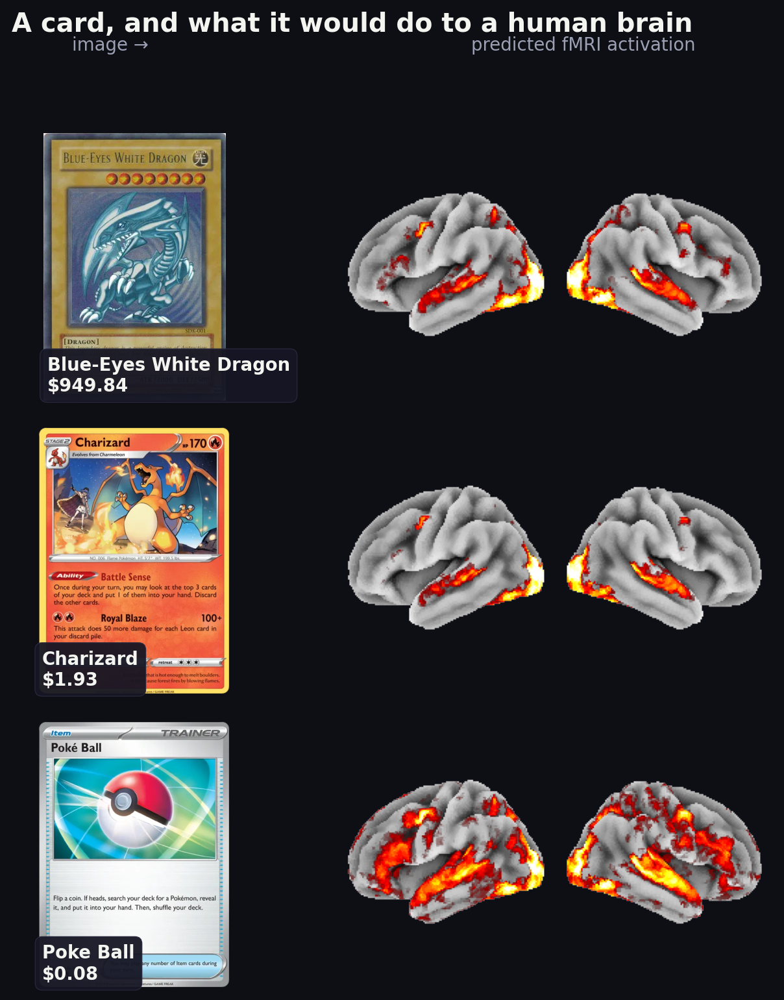
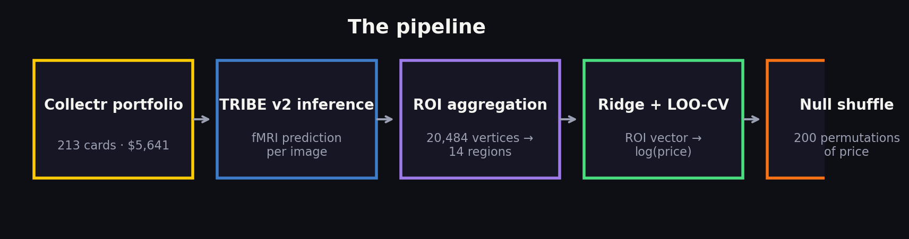
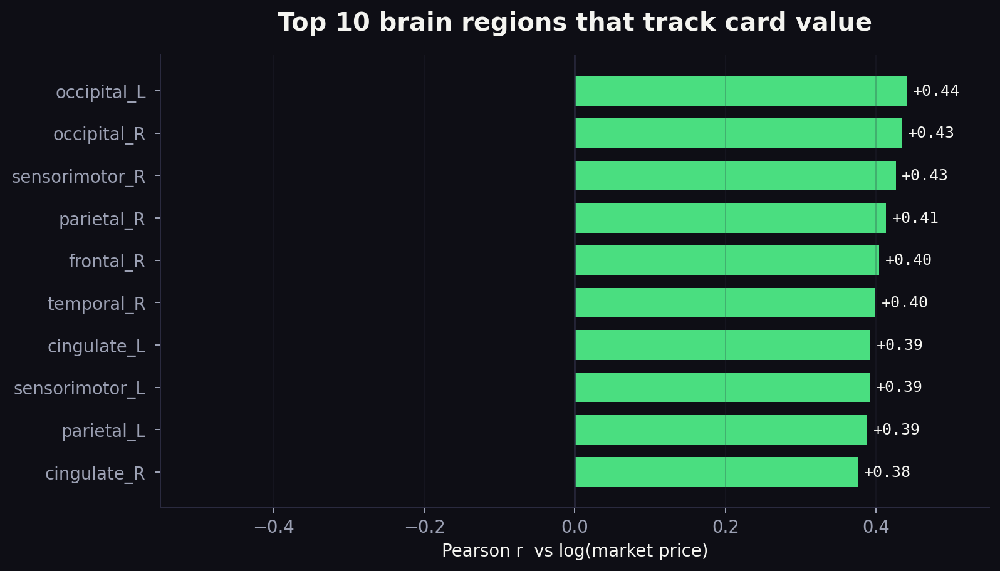
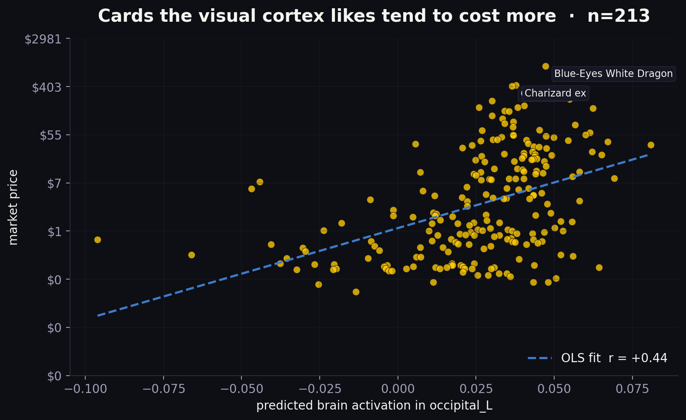

# Does the Human Brain Know Which Pokémon Cards Are Valuable?

### I fed 213 of my cards through Meta's AI model of the human brain. The left visual cortex correlates with price at r = +0.44. And on 61 cards, the brain thinks the market is sleeping.

> 📽️ **18-second explainer** → attach `promo-square-1080x1080.mp4` (in the repo) as an inline video above this line on Medium.

---

I bought a bunch of Pokémon cards recently. Like a responsible collector, I added every one to **[Collectr](https://getcollectr.com)** so I could stare at a dollar total and feel things. Like an irresponsible engineer, I then wondered whether there was a more interesting question in here than "is my collection up or down this week."

Specifically: **does a human brain, looking at a card, *already know* it's valuable — before it reads the set name, checks the rarity symbol, or considers the market?**

Last month, Meta released [**TRIBE v2**](https://github.com/facebookresearch/tribev2) — a foundation model that predicts what a human brain does when presented with a stimulus. You feed it a video, an image, or a piece of audio, and it outputs predicted fMRI BOLD activation across ~20,484 vertices of the cortical surface. It's a digital twin of the visual system, trained on brain scans from 700+ people watching naturalistic media.

So the experiment wrote itself: **scrape every card in my portfolio, run each image through TRIBE v2, and see if predicted brain activation correlates with market price.**

A weekend of wall-clock later, the answer is **yes** — statistically significantly yes. And it gets more interesting when you flip the question around and ask the brain which cards *the market is wrong about.*

---

## The pipeline

Five stages, all Python, all local on an M4 Max:

1. **Scrape** — Playwright signs into Collectr, captures the paginated `/collections/{user}/products` API responses, saves **214 cards** (200 Pokémon + 14 YuGiOh) with prices ranging $0.08 to $949.84. Total book value: **$5,641.** (213 have prices — one card is a condition-report-only listing, so the stats use N=213.)
2. **Wrap each catalog image as a 2-second silent MP4** — TRIBE v2's public API accepts video, not still images. An image repeated for 2 seconds is close enough.
3. **Run each MP4 through TRIBE v2** — On the M4's CPU cores (V-JEPA2's feature extractor is CPU-only for now), a single card takes about 2 minutes. With two parallel workers, **all 214 cards** took ~5.5 hours. Output: a `(n_TRs, 20484)` array per card.
4. **Aggregate vertices into 14 anatomical regions** — occipital, parietal, temporal, sensorimotor, frontal, prefrontal, cingulate (× L/R). A coordinate-based partition on the fsaverage5 mesh. 14 features per card.
5. **Regress** — Ridge regression from the 14-dim ROI vector onto log(market_price), with leave-one-out cross-validation. Then shuffle the price column 200 times and repeat, to build a null distribution.

If there's no real signal, the held-out R² should sit near zero. If there's real signal, it should sit to the right of the null.

## The result

The shuffled null distribution is centered near zero (mean −0.010). The real model's held-out R² is **+0.095** — beating 100% of 200 shuffled controls.

For a 14-feature model with zero information about rarity, set, scarcity, or print run — just predicted brain activation — that's real. On unseen cards, it explains ~9% of log-price variance.

## Which regions are doing the work?

Every one of the top 10 regions is **positively** correlated with log(price). The left occipital lobe — the primary visual cortex — leads at **r = +0.44**. The right visual cortex is right behind at +0.43. Sensorimotor, parietal, frontal: similar strength.

**Translation**: cards that make a predicted human brain's visual system fire harder tend to be more expensive.

## Cards the visual cortex likes cost more, period

Each dot is a card. Horizontal: predicted activation in left visual cortex. Vertical: log(price). The two highest dots at the top-right are — unsurprisingly — a **Blue-Eyes White Dragon** and a **Charizard ex**. The cheapest cards bunch in the bottom-left. The upward trend is the whole story.

---

## Where it gets fun: the brain's bets

Correlation is one thing. **Disagreement is more interesting.** For every card I computed two ranks:

- `market_rank` — 1 is most expensive out of 213
- `brain_rank` — 1 is the strongest predicted brain response out of 213

Subtract one from the other and you get a leaderboard of *where the brain and the market disagree most.* Of my 213 cards:

- **61** land in "the brain ranks this much higher than the market does" (rank gap ≥ 30 positions)
- **68** land in "the market ranks this much higher than the brain does"

**Hidden gems — the brain's top 5 underrated cards:**

| Card | Market | Brain says | Brain rank Δ |
|---|---|---|---|
| Harpie's Pet Baby Dragon (Enemy of Justice) | **$1.14** | should cost ~$75.80 | +105 ranks |
| Clawitzer (JP, Rising Fist) | **$1.00** | should cost ~$51.25 | +104 ranks |
| Beedrill (XY Base Set) | **$1.48** | should cost ~$82.78 | +99 ranks |
| Blaziken (JP, Rising Fist) | **$3.52** | should cost ~$163.33 | +89 ranks |
| Delphox (XY Base Set) | **$2.11** | should cost ~$66.25 | +86 ranks |

**Market knows best — the brain's top 5 skeptics:**

| Card | Market | Brain says | Brain rank Δ |
|---|---|---|---|
| Snorlax (EX FireRed & LeafGreen) | **$119.56** | should cost ~$0.66 | −134 ranks |
| Fire Energy (EX Power Keepers) | **$7.72** | should cost ~$0.12 | −129 ranks |
| Fighting Energy (EX Power Keepers) | **$5.80** | should cost ~$0.12 | −127 ranks |
| Ditto (EX Delta Species) | **$37.28** | should cost ~$0.51 | −126 ranks |
| Mew (EX Holon Phantoms) | **$171.09** | should cost ~$1.00 | −123 ranks |

That's "implied price," not a prediction — it's *the actual market price at the brain's ranked position*, which is a way more honest projection than the Ridge regression's dollar output (which compresses everything toward the mean and is not useful as a point forecast).

But the pattern is striking. The hidden gems are **visually loud full-art Pokémon** — dragons, flames, bold centered illustration — trading for a dollar. The market's favorites that the brain ignores are **simple, iconic, text-heavy cards** whose value comes from scarcity and nostalgia, not from anything you can see. Fire Energy is literally just a red circle with a flame. Mew is a graceful but minimalist portrait. The brain can't tell those are rare; the market can.

This is the useful framing of the whole experiment: **the visual cortex is good at spotting cards designed to look expensive, and completely blind to cards that are expensive despite looking plain.**

---

## What this isn't

**Not a claim that the brain determines Pokémon prices.** That would be silly. Prices are set by scarcity, nostalgia, tournament meta, anime episodes, grading population reports, and the whims of TCGplayer.

The honest framing: *the visual features that make a card expensive also produce distinctive predicted neural activation.* These are the same features — saturated holographic foils, ornate illustration, unusual framing, bold focal characters. A Charizard Base Set and a Rayquaza Delta Species both *look like* they should be valuable, and TRIBE v2 agrees.

That's an aesthetic-neuroeconomic signature. It's not magic and it's not financial advice.

## Why this is interesting anyway

- **The rarity → value chain passes through visual design.** Pokémon decides what rare cards look like — bold art, holo patterns, alt framing — and those decisions are, intentionally, visually salient. The visual cortex is detecting a real design signal, not hallucinating one.
- **The snapshot version invites a sequel.** Re-scrape in 6 months and see whether the "hidden gems" systematically rise relative to the "skeptics." If they do, this is a weird leading indicator. If not, it's a correlation without a forecast. Either is interesting.
- **It's a fun showcase for TRIBE v2 outside neuroscience.** Meta built this for researchers studying the brain. Pointing it at 213 Pokémon cards is silly. It also works.

## The caveats, in one place

- **Small N.** 213 cards × 14 features would overfit a ridge regression without leave-one-out + a shuffle control. The null-distribution plot above *is* the shuffle control. But a single collection isn't the world.
- **TRIBE v2 was not trained on card images** — it was trained on naturalistic video, audio, and images. A static Pokémon card in a 2-second silent loop is out-of-distribution. Signal survives anyway.
- **Only the visual stream contributed.** Wrapping a still image as silent video means the audio and language extractors see nothing. The +0.44 r comes purely from V-JEPA2's visual features.
- **Correlation ≠ causation, and your brain is not a price oracle.** The scatter's top-right being the usual suspects (Blue-Eyes, Charizards) means the visual cortex is rediscovering "bold, famous, recognizable" — which we already knew was valuable.
- **The "implied price" column in the tables above is a rank-swap, not a forecast.** It's a way to translate "the brain ranks this card near the top" into "here is what cards at that market rank actually sell for." Treat it as a disagreement score, not a target price.

## Code + full interactive site

- [Live site with all 213 cards, hidden gems, and skeptics](#) (add your deployment URL)
- [GitHub](#) (add your repo URL)

Pipeline is five Python scripts, a Jinja2 template, a Makefile, and a Remotion project for the promo video. Everything runs on one laptop with no cloud costs. TRIBE v2 is [CC BY-NC](https://github.com/facebookresearch/tribev2) — personal experiments only.

If you're a collector with a few hundred cards, I'd love to see what your portfolio looks like through this lens. Fork the repo and tell me whether your brain agrees with the market, or whether yours is smarter.
